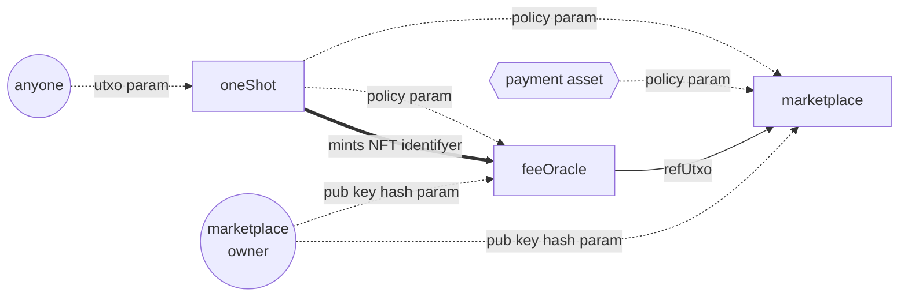
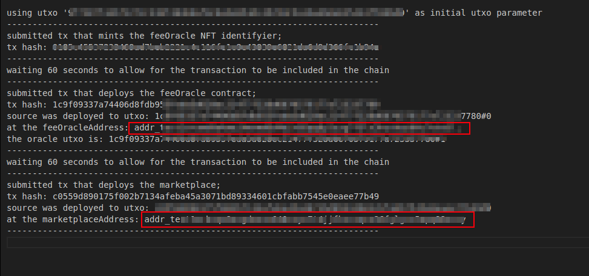

# 🏪 ecosystem-marketplace-contracts

[](https://opensource.org/licenses/Apache-2.0)
[](https://www.cardano.org/)

Smart contracts powering the ecosystem marketplace. This repository contains the core blockchain components for NFT minting, fee management, and marketplace operations.

## 📚 Table of Contents

- 🚀 Getting Started
  - [Prerequisites](#prerequisites)
  - [Installation](#installation)
- 🔭 Project Overview
- 🏗 Contract Architecture
- 📂 Project Structure
- 🛠 Usage
  - [Configure for Contract Deployment](#configure-for-contract-deployment)
  - [Deploy Marketplace](#deploy-marketplace)
- 🤝 Contributing
- 📜 License

## 🚀 Getting Started

### Prerequisites

- API key from [blockfrost](https://blockfrost.dev/overview/getting-started) or use [koios](https://developers.cardano.org/docs/get-started/koios/)
- Node.js v16+ (Nix is recommended for dependency management)

### Installation

1. Clone the repository:

   ```bash
   git clone https://github.com/Vaka-Consulting/ecosystem-marketplace-contracts.git
   cd ecosystem-marketplace-contracts
   ````

2.  Install dependencies:

    ```bash
    npm i
    ```

## 🔭 Project Overview

The Empowa Marketplace Contracts repository contains three core components:

1.  **NFT Minting Policy** (`oneShot`)
2.  **Dynamic Fee Oracle** (`feeOracle`)
3.  **Main Marketplace Contract**

These smart contracts work together to enable:

  - NFT creation with custom policies
  - Dynamic fee adjustments by authorized parties
  - Secure marketplace transactions
  - Owner-controlled parameters
  - UTXO-based transaction handling

## 🏗 Contract Architecture



## 📂 Project Structure

```
ecosystem-marketplace-contracts/
├── app/          # Interaction scripts and utilities
├── src/          # Core contract source code
└── test/         # Test suites
```

See full structure documentation in [docs/project_structure/README.md](./docs/project_structure/README.md)


## 🛠 Usage

### Configure for Contract Deployment

1. Wallet creation if you need to crate new: [How to create wallet](https://developers.cardano.org/docs/integrate-cardano/creating-wallet-faucet/)
   ```bash
   mkdir local/testnet -p

   cardano-cli address key-gen \
      --verification-key-file ./local/testnet/marketplace_deploy.vkey \
      --signing-key-file ./local/testnet/marketplace_deploy.skey

   cardano-cli address build \
      --payment-verification-key-file ./local/testnet/marketplace_deploy.vkey \
      --out-file ./local/testnet/marketplace_deploy.addr \
      --testnet-magic 1

   cat ./local/testnet/marketplace_deploy.addr
   ```
2.  Configure `marketplace.config.json`:

    ```json
    {
      "network": "preprod",
      "signer": "./local/testnet/marketplace_deploy.skey",
      "owner_address": "addr***",
      "blockfrostProjectId": "<api key from blockfrost>", // Optional: Leave as non-string(null) for Koios
      "feeNumerator": 250000, // 2.5% fee (250000 / 1000000)
      "paymentAsset": {
        "policy": "<token_policy>",
        "tokenNameHex": "<token name in hex>"
      }
    }
    ```

    **Explanation of Configuration Options:**

      - `"network"`: Network where the smart contract is deployed.
      - `"signer"`: Path to the signing key file for the marketplace owner.
      - `"owner_address"`: Address of the marketplace owner's wallet.
      - `"blockfrostProjectId"`: API key for Blockfrost (optional; use Koios if omitted or non-string).
      - `"feeNumerator"`: Initial fee for the `feeOracle` (0-1000000, where 1000000 = 100%).  A quick way to calculate your `feeNumerator` is to multiply the percentage by 10,000.  For example, for 2.5%, calculate `2.5 * 10000 = 25000`.
      - `"paymentAsset"`: Policy ID and token name (in hex) of the payment asset.

3. Run Tests

    ```bash
    npm run test-al

    # or

    pnpm run test-al
    ```
    

4.  Deploy Marketplace

    Ensure the owner wallet has at least 30 ADA (10 ADA is deposited into the smart contract, and another 10 is for the feeOracle NFT).

    ```bash
    npm run marketplace:deployAll
    ```

    This should output something like this:

    

    
-----

## 🤝 Contributing

We welcome contributions\! Please see the [CONTRIBUTING.md](./CONTRIBUTING.md) file for guidelines.

## 📜 License

This project is licensed under the **Apache License**. See the [LICENSE](LICENSE) file for details.

